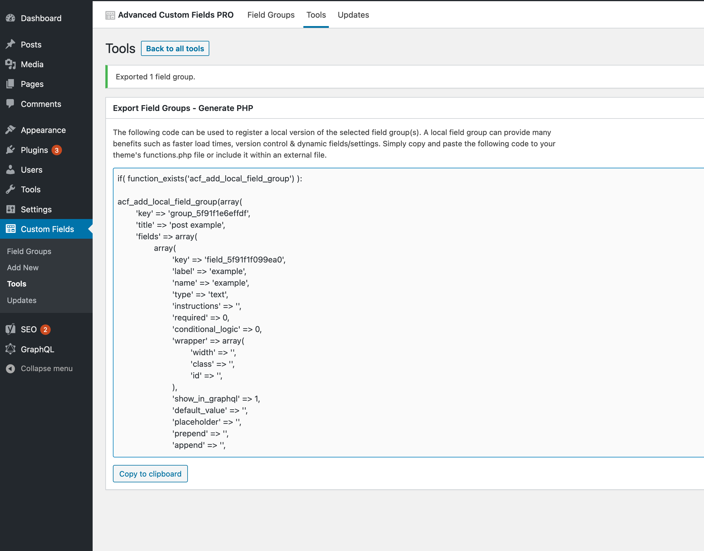

# WP GraphQL mutation child theme

This is an example child theme for TwentyTwenty displaying how to mutate a profile field from the user in WordPress.

It works off the core functionality implemented in WPGraphQL. In addition, it adds a couple profile fields to the user profile for SEO, therefore it relies on the WP GraphQL Yoast extension.

An ACF field can also be obtained if set inside resolve function response field for the custom field. This uses a custom field that is not registered through ACF, but can be added through ACF and likewise obtained programmatically in the resolver.

## Requirements

1. WordPress with TwentyTwenty theme installed and the following plugins listed

2. [WPGraphQL](https://github.com/wp-graphql/wp-graphql)

3. [WPGraphQL Yoast](https://github.com/ashhitch/wp-graphql-yoast-seo)

4. Frontend to run the mutations.

## function

It adds the following profile fields to the user:

1. GitHub profile link. It only adds it internally so that you could edit the profile fields through the mutation anyways, but you could always add it the WordPress admin dashboard through a filter.

It hooks into the existing fields on the user profile:

2. LinkedIn email

3. Twitter username (without the @)

## ACF field update

It also updates a field created through ACF programmatically. This field gets created when the theme activates.

The field ID can be obtained either from the key assigned to the field or through the export function if working on the ACF gui.



## Current conflicts for ACF User fields

1. Fields added to user may not show up when added with ACF because user profile fields contain sensitive data. It requires the configuration with ACF to configure what role may view profile fields.

    - resolution:
    
        1. Hook into the user response to check for credentials and authorizing the current user requesting the data.
        
2. If you don't create the fields initially through ACF or through a mutation, then the GraphQL query for the profile links throws an error. 

## Mutation

### Regular custom fields added through user meta

typical input:
```json
{
  "input": {
    "github": "https://github.com/saleebm",
    "twitter": "minasa1eeb",
    "linkedIn": "https://www.linkedin.com/in/link-up-with-mina-saleeb/",
    "id": "dXNlcjoy",
    "clientMutationId": "test1"
  }
}
```

```graphql
# the mutation
mutation UPDATE_USER_SOCIAL_LINKS($input: UpdateUserInput!) {
  updateUser(input: $input) {
    clientMutationId
    user {
      personalLinks {
        github
      }
      seo {
        social {
          twitter
          linkedIn
        }
      }
    }
  }
}

# the result for users
query RESULT {
  users {
    edges {
      node {
        personalLinks {
          github
        }
        seo {
          social {
            twitter
            linkedIn
          }
        }
      }
    }
  }
}

```

### ACF field mutations

Input for the mutation
```json
{
  "input": {
    "clientMutationId": "test1324",
    "id": "cG9zdDoyNjYz",
    "title": "example1",
    "example": "test"
  }
}
```

The mutation to update the ACF field
```graphql
# update post
mutation UPDATE_POST($input: UpdatePostInput!) {
  updatePost(input: $input) {
    clientMutationId
    post {
      id
      title
      example {
        example
        fieldGroupName
      }
    }
  }
}

```
